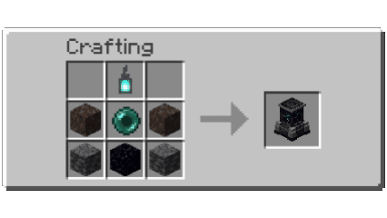

<div align="center">


# Soul Anchor

Plugin dịch chuyển cá nhân dành cho HaoHan SMP.

[](https://www.minecraft.net/)
[](https://papermc.io/)
[](https://purpurmc.org/)
[](https://openjdk.org/)
[](https://maven.apache.org/)

Ngôn ngữ: Tiếng Việt | [English](README.en.md)

</div>

## Tổng Quan

Soul Anchor là plugin Minecraft dành cho server survival Paper/Purpur `1.21.11`. Plugin cho phép người chơi đặt các Soul Anchor riêng trong thế giới, mở GUI để chọn điểm đến, và dịch chuyển với chi phí rõ ràng thay vì hoạt động như một lệnh `/home` miễn phí.

Mỗi Soul Anchor là một điểm dịch chuyển vật lý. Người chơi phải tương tác với anchor để mở mạng dịch chuyển của mình, sau đó chọn một anchor khác làm điểm đến. Mặc định mỗi người chơi sở hữu tối đa `3` Soul Anchor.

## Công Nghệ Sử Dụng

| Toolkit | Vai trò |
| --- | --- |
| Paper API | Nền tảng API chính để phát triển plugin server. |
| Purpur | Môi trường server khuyến nghị để triển khai. |
| Java 21 | Ngôn ngữ và runtime chính của plugin. |
| Maven | Quản lý dependency và build file `.jar`. |
| Resource Pack | Hiển thị model và texture Soul Anchor tùy chỉnh. |

## Thành Phần Dự Án

| Thành phần | Mô tả |
| --- | --- |
| Plugin | Mã nguồn Paper/Purpur plugin trong `src/`, xử lý item, anchor, GUI, teleport, command và config. |
| Resource pack (`rsp`) | Source resource pack dùng để hiển thị model và texture Soul Anchor tùy chỉnh. |

## Tính Năng

- Giới hạn mặc định `3` Soul Anchor mỗi người chơi.
- GUI 27 slot, 3 vị trí anchor được căn giữa.
- Chủ anchor có thể dùng `/soulanchor share <anchor> <player>` để chia sẻ quyền dịch chuyển.
- Giới hạn chỉ áp dụng cho anchor do người chơi sở hữu; anchor được share không tính vào giới hạn.
- GUI mặc định chỉ hiển thị tối đa `3` anchor sở hữu. Anchor được share nằm trong menu riêng có phân trang; mỗi người share chiếm một hàng với tối đa `3` điểm dịch chuyển.
- Teleport có warmup, cooldown và kiểm tra vị trí an toàn.
- Điểm đến ưu tiên vị trí đứng cạnh Soul Anchor.
- Yêu cầu mặc định: `10 level / 1000 block`; quãng đường đến `2.000 block` không tốn Echo Shard.
- Quãng đường trên `2.000 block` tốn cố định `1 Echo Shard`.
- Câu cá có `1% + 0,25%` cho mỗi cấp Luck of the Sea để nhận Echo Shard, không giới hạn lượt.
- Warden do người chơi hạ có `15%` rơi thêm `1 Echo Shard`.
- XP thực trả: `8 điểm XP` cho mỗi level yêu cầu; level yêu cầu chỉ là điều kiện để dịch chuyển.
- Khác dimension: yêu cầu `30 level` + `1 Echo Shard`, trừ XP theo cùng công thức.
- Dữ liệu anchor được lưu tại `plugins/SoulAnchor/anchors.yml`.
- Chỉ người trực tiếp đặt anchor mới có thể phá; người được share và người chơi khác không thể phá.
- Hỗ trợ resource pack để hiển thị model Soul Anchor riêng.

Ví dụ khi người chơi bắt đầu đúng level yêu cầu và thanh XP đang ở đầu level:

| Khoảng cách | Level yêu cầu | XP thực trừ | Echo Shard | Level còn lại |
| --- | ---: | ---: | ---: | ---: |
| Đến 1.000 block | 10 | 80 XP | 0 | 6 |
| Đến 2.000 block | 20 | 160 XP | 0 | 16 |
| Đến 3.000 block | 30 | 240 XP | 1 | 27 |
| Đến 4.000 block | 40 | 320 XP | 1 | 38 |
| Đến 5.000 block | 50 | 400 XP | 1 | 48 |

Các mốc tiếp theo tiếp tục theo cùng công thức: level yêu cầu tăng `10` mỗi `1.000 block`, còn XP thực trừ bằng `level yêu cầu × 8`. Level còn lại có thể khác bảng nếu người chơi có level hoặc tiến trình XP ban đầu cao hơn.

## Yêu Cầu

- Minecraft server chạy Paper hoặc Purpur `1.21.11`.
- Java `21`.
- Maven nếu cần build từ mã nguồn.
- Resource pack Soul Anchor để hiển thị model tùy chỉnh.

## Cài Đặt

1. Build plugin hoặc tải file `.jar`.
2. Copy file `.jar` vào thư mục `plugins/` của server.
3. Cài resource pack Soul Anchor cho client hoặc cấu hình server để người chơi tải resource pack khi tham gia.
4. Restart server.
5. Lấy Soul Anchor bằng recipe hoặc lệnh admin `/soulanchor give <player> [amount]`.

## Resource Pack

Resource pack là bắt buộc nếu muốn Soul Anchor hiển thị đúng model tùy chỉnh. Nếu không cài pack, item hoặc model hiển thị trong thế giới có thể bị sai hoặc hiện texture tím-đen.

File resource pack build sẵn trong workspace local:

```text
target/anchor_spawn_point_fixed.zip
```

Sau khi thay resource pack, reload resource bằng `F3 + T` hoặc restart game.

## Recipe



Công thức tạo `1x Soul Anchor` sử dụng Soul Lantern, Soul Sand, Ender Pearl, Deepslate và Obsidian. Recipe có thể bật hoặc tắt trong `config.yml` bằng `recipe.enabled`.

## Cách Sử Dụng

1. Đặt Soul Anchor trong thế giới.
2. Right click vào Soul Anchor để mở GUI.
3. Chọn anchor đích trong mạng Soul Anchor.
4. Chờ warmup hoàn tất.
5. Plugin kiểm tra lại anchor, vị trí an toàn và chi phí.
6. Người chơi được teleport đến vị trí an toàn cạnh anchor đích.

Teleport sẽ bị hủy nếu người chơi di chuyển quá xa, nhận damage, gây damage, chết hoặc logout trong thời gian warmup.

## Lệnh

| Lệnh | Mô tả |
| --- | --- |
| `/soulanchor` | Hiển thị danh sách anchor của bạn. |
| `/soulanchor list` | Hiển thị danh sách anchor của bạn. |
| `/soulanchor list <player>` | Admin xem anchor của người chơi khác. |
| `/soulanchor give <player> [amount]` | Trao Soul Anchor cho người chơi. |
| `/soulanchor rename <anchor> <new-name>` | Đổi tên anchor của bạn; hỗ trợ tên anchor và tên mới có khoảng trắng. |
| `/soulanchor share <anchor> <player>` | Share anchor của bạn cho một người chơi đang online. Tên anchor có thể chứa khoảng trắng. |
| `/soulanchor reload` | Reload config và recipe. |

Alias:

```text
/sa
```

## Permission

| Permission | Mặc định | Mô tả |
| --- | --- | --- |
| `soulanchor.use` | true | Cho phép dùng GUI và teleport. |
| `soulanchor.place` | true | Cho phép đặt Soul Anchor. |
| `soulanchor.break.own` | true | Cho phép phá anchor của chính mình. |
| `soulanchor.rename` | true | Cho phép đổi tên anchor. |
| `soulanchor.share` | true | Cho phép share anchor của mình cho người chơi khác. |
| `soulanchor.admin` | op | Quyền admin tổng quát. |
| `soulanchor.admin.give` | op | Cho phép dùng lệnh give. |
| `soulanchor.admin.reload` | op | Cho phép reload config. |
| `soulanchor.bypass.cost` | op | Bỏ qua chi phí teleport. |
| `soulanchor.bypass.cooldown` | op | Bỏ qua cooldown. |
| `soulanchor.bypass.warmup` | op | Bỏ qua warmup. |
| `soulanchor.limit.unlimited` | false | Không giới hạn số anchor. |

Plugin cũng hỗ trợ permission giới hạn như `soulanchor.limit.5` hoặc `soulanchor.limit.10`.

## Cấu Hình

File config được tạo tại:

```text
plugins/SoulAnchor/config.yml
```

Một số key quan trọng:

| Key | Mặc định | Mô tả |
| --- | --- | --- |
| `limits.default` | `3` | Số anchor mặc định mỗi người chơi. |
| `item.id` | `haohansmp:soul_anchor` | ID nội bộ và item model. |
| `item.material` | `BARRIER` | Item nền để craft/give; model riêng dùng `item.item-model`. |
| `item.placed-block` | `BARRIER` | Block placeholder khi đặt anchor. |
| `distance.blocks-per-tier` | `1000` | Số block mỗi tier chi phí. |
| `distance.levels-per-tier` | `10` | Số level mỗi tier. |
| `teleport.echo-shard-cost` | `1` | Echo Shard tiêu hao khi vượt ngưỡng miễn phí. |
| `teleport.echo-shard-free-distance` | `2000` | Khoảng cách tối đa không tốn Echo Shard. |
| `teleport.experience-points-per-required-level` | `8` | Điểm XP thực trả cho mỗi level yêu cầu. |
| `echo-shard-sources.fishing.base-chance` | `0.01` | Tỉ lệ câu được Echo Shard khi không có Luck of the Sea. |
| `echo-shard-sources.fishing.luck-bonus-per-level` | `0.0025` | Tỉ lệ cộng thêm cho mỗi cấp Luck of the Sea. |
| `echo-shard-sources.warden.drop-chance` | `0.15` | Tỉ lệ Warden do người chơi hạ rơi Echo Shard. |
| `teleport.warmup-seconds` | `3` | Thời gian warmup. |
| `teleport.cooldown-seconds` | `30` | Cooldown sau teleport. |
| `cross-dimension.level-cost` | `30` | Level yêu cầu khi teleport khác dimension. |
| `visuals.idle-particle-interval-ticks` | `40` | Số tick giữa các nhịp particle idle. |
| `visuals.idle-particle-batch-size` | `32` | Số anchor tối đa được xử lý mỗi nhịp particle. |
| `visuals.particle-view-distance` | `24` | Bán kính player có thể thấy particle idle. |

## Build Từ Mã Nguồn

Chạy lệnh sau tại thư mục gốc dự án:

```bash
mvn clean package
```

File jar Maven nằm trong:

```text
target/soul-anchor-1.0.4.jar
```

Trong workspace local có thể có thêm:

```text
target/soul-anchor-1.0.4.jar
target/anchor_spawn_point_fixed.zip
```

## Ghi Chú Vận Hành

- Khi cập nhật model, hãy thay cả plugin jar và resource pack.
- Nếu item cũ vẫn hiển thị sai, lấy item mới bằng `/soulanchor give` sau khi server đã chạy jar mới.
- Thư mục `rsp/` là source resource pack local và không nên push nếu không thật sự cần.
